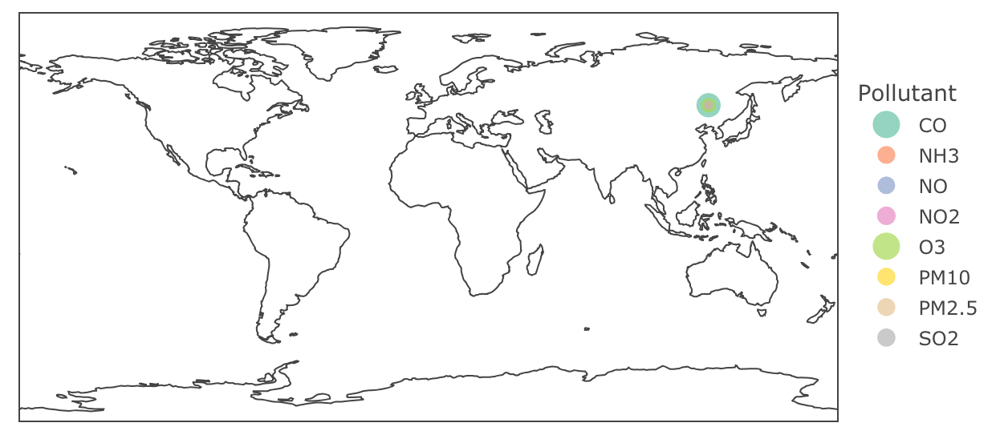
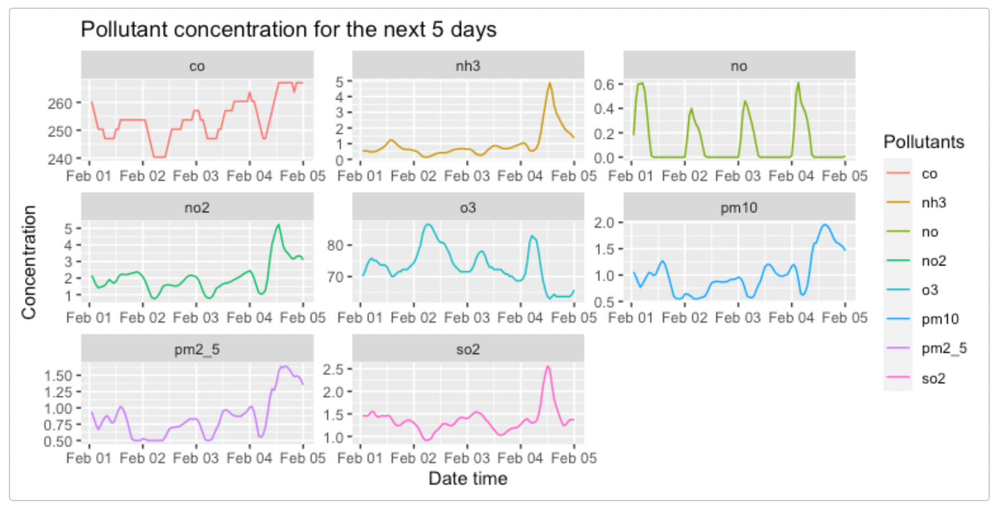

```{r, include = FALSE}
knitr::opts_chunk$set(
  collapse = TRUE,
  comment = "#>"
)
```


This document introduces you to `rpollution`’s functions, and shows you how to use them with data fetched from [OpenWeatherMap API](https://openweathermap.org/api).
As these are wrapper functions, usage requires sign up to OpenWeatherMap for free to gain access to an API key. 

For more information about API call limits and API care recommendations please visit the OpenWeather [how to start](https://openweathermap.org/appid) page.

Each function will require you to pass in your generated API key. This can either be read 
in from a `config.json` file or you can pass it in directly as a string.
To set it up using a config file create a `config.json` in the root directory and add 
your API key like the following:

```{json}
{
  "api_key": "API_KEY_0001"
}
```

You can then set your API key as a variable using the following code:
```{r, eval=FALSE}
my_secrets <- function() {
  path <- "path/to/config/config.json"
  if (!file.exists(path)) {
    stop("Can't find secret file: '", path, "'")
  }
  
  jsonlite::read_json(path)
}

api_key <- my_secrets()$api_key
```


### Load the library
```{r setup, warning = FALSE}
library(rpollution)
```

### Retrieve historic pollution data with specified date range and location:
This function fetches the historic air pollution levels based on a location. It 
requires a start and end date and re-formats the data into a more usable data frame
with the values of the polluting gases over the specified date range.

Note: Historical data is accessible from 27th November 2020

```{r historic-example, eval=FALSE}
df <- get_pollution_history(1606488670, 1606747870, 49.28, 123.12, "api_key")
```

```{r, echo=FALSE}
df <- read.csv("../man/data/pollution_data.csv")
```

```{r historic-example-result}
head(df)
```

### Generate an interactive map containing current pollution data by location:
To visualize air pollution levels at a given location, you can use this function 
with location coordinates and view the Air Quality Index levels on a world map. 
This coloured map is interactive and displays the varying regions of air quality.

Additionally, you can add a title to the plot by passing the string as the 
final argument.

```{r current-example, eval=FALSE}
pollution_map_plot <- get_air_pollution(49.28, 123.12, api_key, "Current Air Pollution")
```

```{r current-example-result, fig.width=7, fig.height=4, eval=FALSE}
pollution_map_plot
```

```{r, echo=FALSE, out.width="50%"}

```

### Generate a time-series line chart of forecasted air pollution data:
This function will show you air pollution data for the next 5 days for a specific 
location. It will return a time series plot for each of the 8 air pollutants and 
show the varying levels of predicted pollution over time.


```{r forecast-example, eval=FALSE}
forecast_plot <- get_pollution_forecast(49.28, 123.12, api_key)
```

```{r forecast-example-result, fig.width=8, fig.height=4, eval=FALSE}
forecast_plot
```

```{r, echo=FALSE, out.width="50%"}

```


